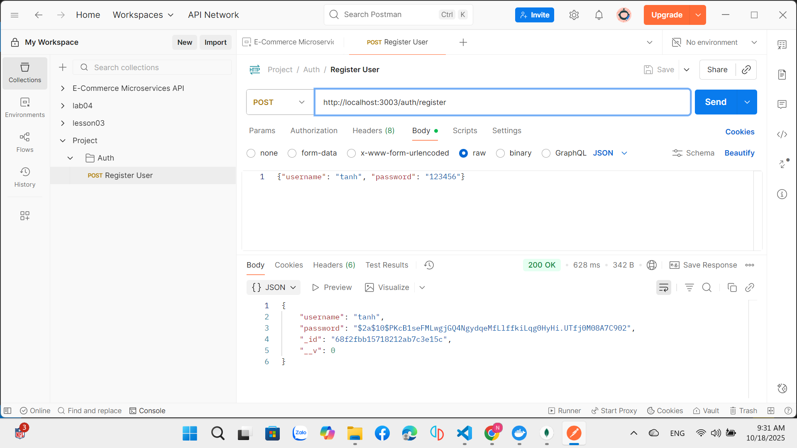
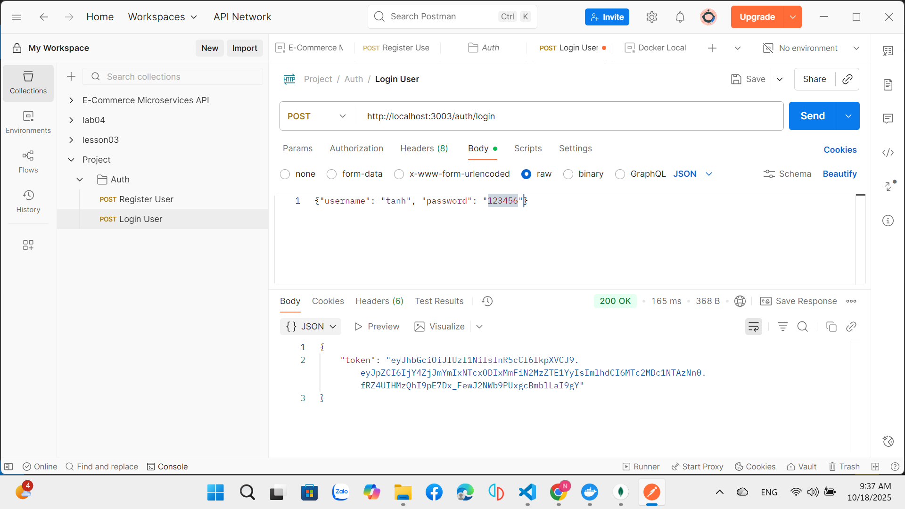
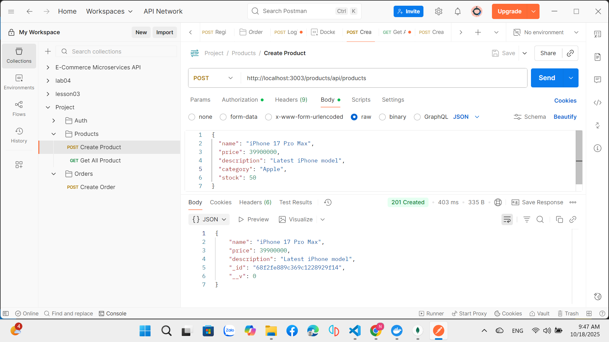
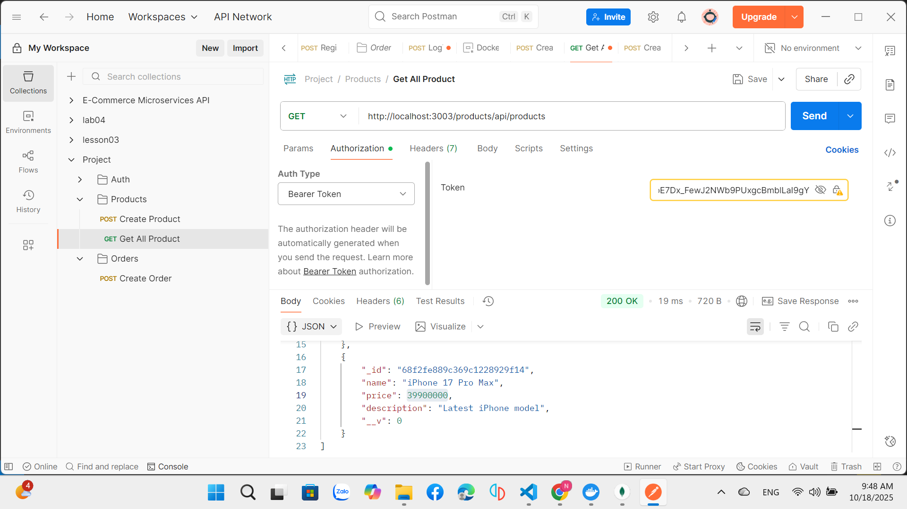
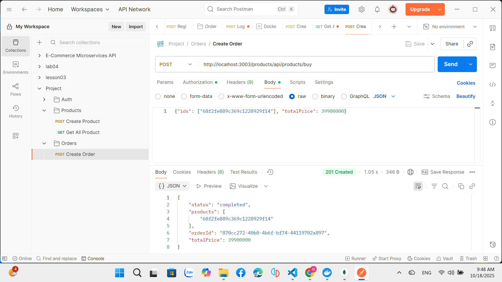
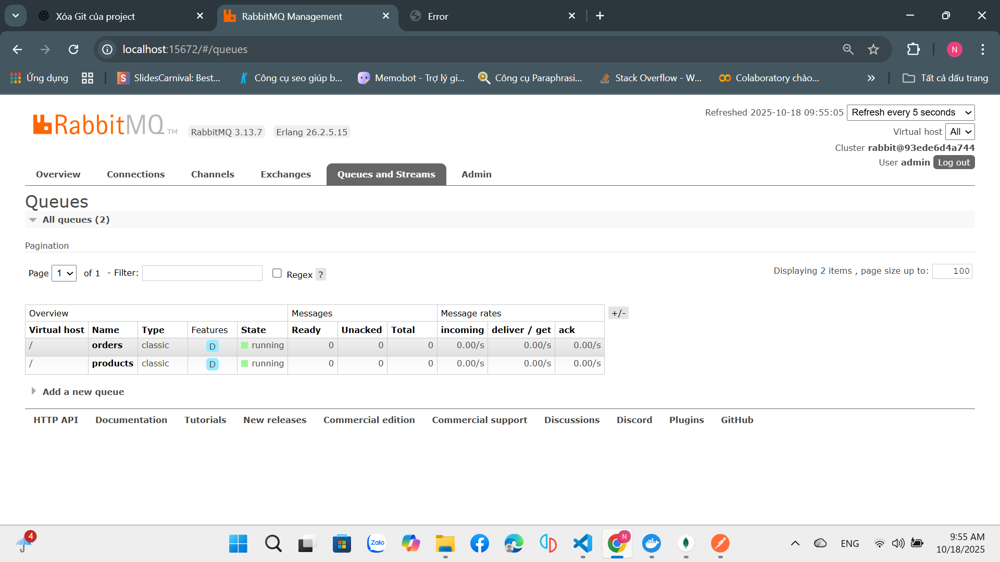

# EProject - Microservices E-commerce Platform

## 📖 Mô tả dự án

Dự án EProject là một hệ thống e-commerce được xây dựng theo kiến trúc microservices sử dụng Node.js, Express, MongoDB và RabbitMQ. Hệ thống bao gồm các service chính:

- **Auth Service** (Port 3000): Xử lý đăng nhập, đăng ký và xác thực người dùng
- **Product Service** (Port 3001): Quản lý sản phẩm và tạo đơn hàng
- **Order Service** (Port 3002): Xử lý đơn hàng
- **API Gateway** (Port 3003): Điều hướng request đến các service tương ứng

### 🏗️ Kiến trúc hệ thống

```
┌─────────────────┐    ┌─────────────────┐
│   API Gateway   │────│   Auth Service  │
│     :3003       │    │      :3000      │
└─────────────────┘    └─────────────────┘
         │                       │
         ├───────────────────────┼─────────────────┐
         │                       │                 │
┌─────────────────┐    ┌─────────────────┐    ┌──────────┐
│ Product Service │    │  Order Service  │    │ MongoDB  │
│      :3001      │    │      :3002      │    │  :27017  │
└─────────────────┘    └─────────────────┘    └──────────┘
         │                       │                 │
         └───────────────────────┼─────────────────┘
                                 │
                       ┌─────────────────┐
                       │   RabbitMQ      │
                       │   :5672/:15672  │
                       └─────────────────┘
```

## 🚀 Cài đặt và chạy dự án

### Yêu cầu hệ thống
- Docker & Docker Compose
- Node.js (nếu chạy local)
- MongoDB
- RabbitMQ

### Chạy với Docker Compose
```bash
# Clone repository
git clone <repo-url>
cd EProject-Phase

# Chạy tất cả services
docker-compose up -d

# Kiểm tra logs
docker-compose logs -f

# Dừng services
docker-compose down
```

### URLs truy cập
- **API Gateway**: http://localhost:3003
- **Auth Service**: http://localhost:3000  
- **Product Service**: http://localhost:3001
- **Order Service**: http://localhost:3002
- **RabbitMQ Management**: http://localhost:15672 (admin/123456)
- **MongoDB**: localhost:27017

## 🧪 Hướng dẫn test API với Postman

### 1. Setup Postman Environment

Tạo environment với các biến:
- `base_url`: `http://localhost:3003`
- `auth_token`: (sẽ được set tự động sau khi login)

### 2. Authentication APIs

#### 2.1 Đăng ký tài khoản
```
POST {{base_url}}/auth/register
Content-Type: application/json

{
  "username": "testuser",
  "password": "123456",
  "email": "test@example.com",
  "fullName": "Test User"
}
```

**Expected Response:**
```json
{
  "message": "User registered successfully",
  "user": {
    "username": "testuser",
    "email": "test@example.com",
    "fullName": "Test User"
  }
}
```

#### 2.2 Đăng nhập
```
POST {{base_url}}/auth/login
Content-Type: application/json

{
  "username": "testuser",
  "password": "123456"
}
```

**Expected Response:**
```json
{
  "token": "eyJhbGciOiJIUzI1NiIsInR5cCI6IkpXVCJ9..."
}

```


### 3. Product APIs

#### 3.1 Tạo sản phẩm
```
POST {{base_url}}/products
Authorization: Bearer {{auth_token}}
Content-Type: application/json

{
  "name": "iPhone 15",
  "price": 999,
  "description": "Latest iPhone model",
  "category": "Electronics",
  "stock": 50
}
```

**Expected Response:**
```json
{
  "_id": "...",
  "name": "iPhone 15",
  "price": 999,
  "description": "Latest iPhone model",
  "category": "Electronics",
  "stock": 50,
  "createdAt": "...",
  "updatedAt": "..."
}
```

#### 3.2 Lấy danh sách sản phẩm
```
GET {{base_url}}/products
Authorization: Bearer {{auth_token}}
```

**Expected Response:**
```json
[
  {
    "_id": "...",
    "name": "iPhone 15",
    "price": 999,
    "description": "Latest iPhone model",
    "category": "Electronics",
    "stock": 50
  }
]
```

#### 3.3 Tạo đơn hàng
```
POST {{base_url}}/products/order
Authorization: Bearer {{auth_token}}
Content-Type: application/json

{
  "ids": ["product_id_1", "product_id_2"]
}
```

**Expected Response:**
```json
{
  "status": "completed",
  "products": [...],
  "username": "testuser",
  "orderId": "uuid-generated-id",
  "totalAmount": 1998,
  "createdAt": "..."
}
```

#### 3.4 Kiểm tra trạng thái đơn hàng
```
GET {{base_url}}/products/order/:orderId
Authorization: Bearer {{auth_token}}
```

## 📸 Kết quả Test với Postman

### 1. Đăng ký tài khoản (Register)

*Test API đăng ký tài khoản mới thành công*

### 2. Đăng nhập (Login)

*Test API đăng nhập và nhận JWT token*

### 3. Tạo sản phẩm (Create Product)

*Test API tạo sản phẩm mới với authentication*

### 4. Lấy danh sách sản phẩm (Get Products)

*Test API lấy danh sách tất cả sản phẩm*

### 5. Tạo đơn hàng (Create Order)

*Test API tạo đơn hàng với sản phẩm đã chọn*

### 6. RabbitMQ Management Interface

*Giao diện quản lý RabbitMQ hiển thị message queues*
